# supply-chain-as-a-service

Reference architecture and working implementation for operating a vendored
Artifact Keeper deployment as a supply-chain hardening system. The repository
vendors Artifact Keeper source, web, and IaC snapshots; builds and signs local
runtime images; scans them; smokes the vendored chart; and promotes immutable
digests into a release registry that a GitOps cluster can consume.

This repo has two jobs:

- Provide a reusable pattern for teams that want to vendor Artifact Keeper, review
  upstream changes on their own cadence, and publish internally trusted images.
- Drive a real homelab deployment through a separate private Flux GitOps repo.
  The private repo contains site-specific hosts, domains, credentials, storage
  paths, and cluster wiring; this repo keeps only reusable build, promotion, and
  example deployment guidance.

## What This Proves

The core idea is supply-chain hardening for the supply-chain tool itself. Instead
of deploying upstream images directly, the operator imports reviewed upstream
source snapshots, records provenance, builds from local source on controlled
runners, attaches evidence, and deploys only signed digests that passed the local
policy gate.

The current pattern includes:

- Full-history vendoring of [artifact-keeper](artifact-keeper),
  [artifact-keeper-web](artifact-keeper-web), and
  [artifact-keeper-iac](artifact-keeper-iac).
- Provenance records in [UPSTREAM.md](UPSTREAM.md) and
  [vendor/upstreams.tsv](vendor/upstreams.tsv).
- Local patches tracked under [patches](patches), with upstream disposition kept
  explicit.
- PR builds for backend and web images, split so large images can build in
  parallel on self-hosted runners.
- BuildKit registry cache export/import, because the Artifact Keeper images are
  large and warm caches materially change feedback time.
- Trivy scanning, cosign signing by digest, verify-before-smoke, and retained
  build records.
- Staging and release promotion by digest, without rebuilding on merge.
- A scheduled upstream-sync bot that imports upstream releases only after a
  configurable software-age hold, then opens a review PR.
- A GitOps deployment handoff where Flux renders the vendored chart directly from
  Git and pins promoted release images by digest.

```mermaid
%%{init: {"theme": "base", "themeVariables": {"fontSize": "18px", "fontFamily": "Inter, ui-sans-serif, system-ui", "primaryTextColor": "#17212b", "lineColor": "#53616f"}} }%%
flowchart LR
  upstream@{ shape: cloud, label: "Upstream releases" }
  vendor@{ shape: docs, label: "Vendored source<br/>backend + web + IaC" }
  review@{ shape: doc, label: "Human review<br/>+ local patches" }
  build@{ shape: lin-rect, label: "Controlled runner builds" }
  harbor@{ shape: cyl, label: "Harbor / OCI intake<br/>cache + scratch" }
  gate@{ shape: hex, label: "Scan + sign<br/>verify + smoke" }
  release@{ shape: datastore, label: "Release registry<br/>immutable digests" }
  gitops@{ shape: fr-rect, label: "Private Flux GitOps<br/>cluster deploy" }

  upstream --> vendor --> review --> build --> harbor --> gate --> release --> gitops
  harbor -. dissimilar registry tier .-> release

  classDef source fill:#dff3ff,stroke:#277da1,stroke-width:2px,color:#102a43,font-size:18px
  classDef control fill:#fff1c7,stroke:#d99a00,stroke-width:2px,color:#3b2f12,font-size:18px
  classDef registry fill:#e9defa,stroke:#7c3aed,stroke-width:2px,color:#27133f,font-size:18px
  classDef deploy fill:#dff7e7,stroke:#238636,stroke-width:2px,color:#12351f,font-size:18px
  class upstream,vendor source
  class review,build,gate control
  class harbor,release registry
  class gitops deploy
```



## Repository Layout

```text
.gitea/workflows/      Gitea Actions entry points used by the homelab instance
ci/                    build, scan, sign, smoke, promote, and vendor-sync scripts
docs/                  public-safe reference docs and example GitOps patterns
artifact-keeper/       full-history upstream backend subtree
artifact-keeper-web/   full-history upstream web subtree
artifact-keeper-iac/   full-history upstream IaC and Helm chart subtree
UPSTREAM.md            imported revisions and local patch status
patches/               local patches awaiting upstream disposition
vendor/upstreams.tsv   machine-readable upstream pins
```

See [docs/reference-architecture.md](docs/reference-architecture.md) for the
architecture and trust model, [docs/gitops-deployment-example.md](docs/gitops-deployment-example.md)
for the sanitized Flux deployment pattern, and
[docs/runner-options.md](docs/runner-options.md) for Gitea and GitHub ARC runner
options. The [package-manager mTLS survey](docs/package-manager-mtls-support.md)
compares client-certificate support across major ecosystems and describes an
Artifact Keeper deployment protected by Teleport Application Access.

## Workflow

### 1. Vendor Reviewed Upstream Source

Common vendoring commands:

```sh
make vendor-status
make vendor-check
make vendor-update NAME=<name> REF=<reviewed-ref> TAG=<tag-or-dash>
```

Use [ci/subtree-sync.sh](ci/subtree-sync.sh) through the make targets rather than
hand-editing the vendored subtrees. Local divergences that should not be hidden
in the imported trees belong in [patches](patches).

### 2. Validate Source and Chart

```sh
make source-check-chart
make source-check-backend
make source-check-web
make source-check
```

[make source-smoke](Makefile) retains the manually dispatched Kubernetes/chart
smoke path: it installs the vendored chart into a test namespace and runs
native package-client Jobs for PyPI, npm, and Cargo. PR publish CI instead hands
the builder's verified immutable backend digest to the isolated Compose runner,
which executes the same pypi/npm/cargo native-client semantics without rebuilding
the backend. [make source-smoke-compose](Makefile) remains the cluster-free
workstation entry point.

### 3. Build, Scan, Sign, and Smoke

[.gitea/workflows/publish-ci.yml](.gitea/workflows/publish-ci.yml) is the current
CI implementation. Human-authored PRs and explicit dispatches run the publish
path:

```text
builder: build -> push scratch image -> scan -> sign -> verify
compose: pull exact digest -> pypi/npm/cargo smoke -> promote to staging
compose: pull exact backend/web/test digests -> focused Playwright E2E
```

Backend integration and web E2E likewise build their reusable test images once
on the BuildKit fleet and run only the runtime phase on the repository-scoped
Compose pool. The pool is capacity four across Jarvis and Skynet; every Pod is
capacity one, so independent jobs run concurrently without sharing one Podman
engine.

Bot-authored upstream-sync PRs run a validate-only path with no registry or
signing secrets. A maintainer can explicitly authorize a smoke deployment with
`/deploy smoke`, which snapshots the PR head before running the trusted publish
path.

The local equivalent is:

```sh
make ci-publish
```

It requires registry credentials in the environment. Keep those values in CI
secrets or an operator-only credentials store, never in source.

### 4. Promote Release Digests

[.gitea/workflows/promote-release.yml](.gitea/workflows/promote-release.yml) runs
on relevant merges to main. It re-finds the staged images by source key, verifies
the local signature, and copies the same digests into the release registry. The
release output is the handoff to GitOps: deploy `repo:tag@sha256:<digest>`, not a
mutable tag.

## Public Safety Boundary

This repository is intended to be public-safe. Do not commit:

- Real hostnames, LAN IPs, personal domains, node names, or storage paths.
- Registry, Git, cloud, ACME, or signing credentials.
- Generated `.env` files, runner registration tokens, robot-account passwords,
  or private cosign keys.
- Private Flux manifests that reveal machine topology. Keep those in the private
  GitOps repo and copy only sanitized examples here.

Use placeholders such as `git.example.internal`, `registry.example.internal`,
`artifact-keeper-release`, `supply-chain-bot`, and `ak.example.internal` in docs.

## Remotes

The reference workflow assumes an internal Git host for CI and may also mirror to
GitHub for backup or publication. In the homelab implementation, Gitea is the CI
trigger and GitHub is a backup/publication remote. Avoid bidirectional mirroring;
pick one write authority and replicate in one direction.
