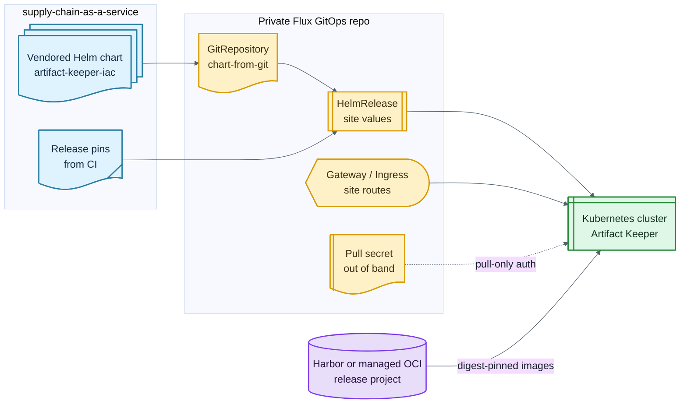

# GitOps Deployment Example

This is a sanitized version of the private homelab pattern. It shows how a Flux
repo can deploy Artifact Keeper from this vendored source repository without
exposing private hostnames, credentials, node names, or storage paths.

## Topology

```text
GitOps repo
  clusters/<cluster>/artifact-keeper.yaml
  apps/artifact-keeper/source.yaml
  apps/artifact-keeper/release.yaml
  apps/artifact-keeper/pull-secret.yaml

Flux
  GitRepository -> this monorepo, scoped to artifact-keeper-iac/charts/artifact-keeper
  HelmRelease   -> renders the vendored chart with site values

Registry
  artifact-keeper-release/artifact-keeper-backend:<source-key>@sha256:<digest>
  artifact-keeper-release/artifact-keeper-web:<source-key>@sha256:<digest>
```

The chart is rendered from Git instead of being published to a Helm repository.
Only release images are deployed, and they are pinned by digest.



## Example Flux Source

```yaml
apiVersion: source.toolkit.fluxcd.io/v1
kind: GitRepository
metadata:
  name: supply-chain
  namespace: flux-system
spec:
  interval: 5m
  url: https://git.example.internal/platform/supply-chain-as-a-service.git
  ref:
    branch: main
  secretRef:
    name: supply-chain-git-readonly
  ignore: |
    /*
    !/artifact-keeper-iac/
    /artifact-keeper-iac/*
    !/artifact-keeper-iac/charts/
    !/artifact-keeper-iac/charts/artifact-keeper/
```

Keep the Git credential as an out-of-band Secret in the GitOps repo or in your
secret-management system. Use a read-only token scoped to this repository.

## Example HelmRelease

```yaml
apiVersion: helm.toolkit.fluxcd.io/v2
kind: HelmRelease
metadata:
  name: artifact-keeper
  namespace: artifact-keeper
spec:
  interval: 10m
  releaseName: artifact-keeper
  chart:
    spec:
      chart: ./artifact-keeper-iac/charts/artifact-keeper
      sourceRef:
        kind: GitRepository
        name: supply-chain
        namespace: flux-system
  values:
    fullnameOverride: artifact-keeper
    backend:
      image:
        repository: registry.example.internal/artifact-keeper-release/artifact-keeper-backend
        tag: v1.2.3-src.abcdef1@sha256:aaaaaaaaaaaaaaaaaaaaaaaaaaaaaaaaaaaaaaaaaaaaaaaaaaaaaaaaaaaaaaaa
      serviceAccount:
        create: false
        name: default
    web:
      image:
        repository: registry.example.internal/artifact-keeper-release/artifact-keeper-web
        tag: v1.2.3-src.abcdef1@sha256:bbbbbbbbbbbbbbbbbbbbbbbbbbbbbbbbbbbbbbbbbbbbbbbbbbbbbbbbbbbbbbbb
      env:
        NEXT_PUBLIC_API_URL: https://registry.example.internal
    postgres:
      enabled: true
    opensearch:
      enabled: true
    trivy:
      enabled: false
    dependencyTrack:
      enabled: false
    edge:
      enabled: false
```

Some chart versions do not expose an `imagePullSecrets` value for every workload.
One practical workaround is attaching a pull-only registry secret to the namespace
default ServiceAccount and configuring the chart to use that ServiceAccount where
needed.

## Example Pull Secret Attachment

```yaml
apiVersion: v1
kind: ServiceAccount
metadata:
  name: default
  namespace: artifact-keeper
imagePullSecrets:
  - name: artifact-keeper-release-pull
```

Create `artifact-keeper-release-pull` outside of public source. A SOPS, External
Secrets, Sealed Secrets, or manual break-glass flow is fine; the key constraint is
that the public reference architecture should not contain live credentials.

## Ingress

Expose two routes if your environment separates UI and package-registry API:

| Host | Backend service | Purpose |
| --- | --- | --- |
| `ak.example.internal` | `artifact-keeper-web` | web UI |
| `registry.example.internal` | `artifact-keeper-backend` | package registry API |

The private homelab implementation uses Gateway API HTTPRoutes behind a shared
cluster gateway. An enterprise environment might use Gateway API, Ingress, an
internal load balancer, or a service mesh. Keep the example values generic and
put real DNS, TLS issuer, and network details in the private GitOps repo.

## Digest Bump Flow

1. Merge a human-reviewed source or chart PR.
2. Let release promotion copy the staged backend and web digests to the release
   project.
3. Read the `release-pins` artifact or workflow notice.
4. Update the GitOps HelmRelease image tags to `<source-key>@sha256:<digest>`.
5. Reconcile Flux and run a standing-instance smoke test against the deployed
   registry endpoint.

## What Not To Copy From A Private GitOps Repo

Do not copy real machine names, LAN IPs, storage paths, personal domains,
wildcard certificate details, admin usernames, robot names, or raw Secrets. Copy
only structure, threat-model decisions, and placeholders.
