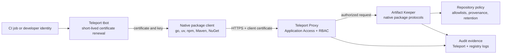

# Package Manager mTLS Support

This document surveys mutual TLS (mTLS) client-certificate support across major
language package managers and relates the results to an enterprise artifact
registry protected by Teleport Application Access.

The motivating architecture is an internal
[Artifact Keeper](../artifact-keeper) instance that serves multiple native
package protocols while Teleport controls network access with short-lived X.509
client certificates. This makes package-manager support for client certificates
a practical supply-chain requirement rather than an unusual transport feature.

The survey was last verified on 2026-07-10.

## Result

Of 21 major package-manager clients surveyed:

- ✅ 11 have documented, usable mTLS support for registry or package HTTP traffic.
- ◐ 6 have partial support through Git, an external downloader, a runtime, or a
  secondary cache transport.
- ❌ 4 have no documented client-certificate path for package HTTP traffic.

The result does not imply that every implementation has the same security
properties. Support ranges from origin- or repository-scoped credentials to one
certificate installed globally for every HTTPS connection made by the process.

## Classification

- **✅ Yes**: documented client-certificate support applies to native registry or
  package HTTP requests.
- **◐ Partial**: mTLS is possible only through a delegated VCS client, external
  downloader, runtime-wide escape hatch, or secondary transport. It does not
  cover the package manager's complete native HTTP workflow.
- **❌ No documented support**: the official authentication and transport surface
  does not expose a client certificate and private key for package HTTP traffic.

Server trust configuration is separate from client authentication. Options such
as CA bundles, system certificate stores, and insecure-host exceptions do not by
themselves provide mTLS.

The language selection is based on ecosystems represented in GitHub's
[2025 top-language list](https://github.blog/news-insights/octoverse/what-the-fastest-growing-tools-reveal-about-how-software-is-being-built/)
and the broader [TIOBE index](https://www.tiobe.com/tiobe-index/). Languages that
share a package ecosystem, such as Java and Kotlin or C# and F#, are grouped.
SQL, shell languages, and infrastructure configuration languages do not have a
single comparable language package manager and are not scored.

## Support matrix

| Languages or ecosystem | Package manager | mTLS | Credential scope | Evidence and notes |
| --- | --- | --- | --- | --- |
| JavaScript, TypeScript | npm | **✅ Yes** | Registry host and optional path | npm documents registry-scoped [`certfile` and `keyfile`](https://docs.npmjs.com/files/npmrc/). The URI-fragment scope prevents credentials from being sent to an unrelated registry. |
| JavaScript, TypeScript | Yarn Modern | **✅ Yes** | Host or hostname pattern | Yarn documents [`httpsCertFilePath` and `httpsKeyFilePath`](https://yarnpkg.com/configuration/yarnrc/). `networkSettings` can override them by hostname pattern. |
| JavaScript, TypeScript | pnpm | **✅ Yes** | Registry URL | pnpm supports URL-scoped `cert` and `key`. Current [release notes](https://github.com/pnpm/pnpm/releases) explicitly describe pinning client TLS credentials to the registry selected by the configuration source. |
| Python | pip | **✅ Yes** | Process-wide | pip provides [`--client-cert` and `PIP_CLIENT_CERT`](https://pip.pypa.io/en/stable/cli/pip/). The file contains the client certificate and private key in PEM format. |
| Python | uv | **✅ Yes** | Process-wide | uv uses [`SSL_CLIENT_CERT`](https://docs.astral.sh/uv/concepts/authentication/certificates/) with one PEM file containing the certificate followed by the private key. mTLS was added in [uv 0.2.11](https://github.com/astral-sh/uv/blob/main/changelogs/0.2.x.md#0211) in June 2024. |
| Java, Kotlin, Scala, Clojure | Maven | **✅ Yes** | JVM-wide | Maven's [authenticated HTTPS repository guide](https://maven.apache.org/guides/mini/guide-repository-ssl.html) configures a PKCS#12 or JKS client keystore through JSSE properties. |
| Java, Kotlin, Groovy | Gradle | **✅ Yes** | Gradle daemon and JVM-wide | Gradle accepts `javax.net.ssl.keyStore` and related properties as daemon configuration, documented in the [Gradle daemon guide](https://docs.gradle.org/current/userguide/gradle_daemon.html). JSSE uses that keystore for TLS client credentials as described in the [JSSE reference](https://docs.oracle.com/en/java/javase/13/security/java-secure-socket-extension-jsse-reference-guide.html). |
| C#, F#, Visual Basic | NuGet | **✅ Yes** | Package source | [NuGet 5.7](https://learn.microsoft.com/en-us/nuget/release-notes/nuget-5.7) added package-source client certificates, including file/PFX and Windows certificate-store configuration. See the [implementation commit](https://github.com/NuGet/NuGet.Client/commit/788bc01a1b063a37841cdd6d035feb320e90e475). |
| PHP | Composer | **✅ Yes** | Repository | Composer supports per-repository TLS stream options such as `ssl.local_cert`; its [private package documentation](https://getcomposer.org/doc/articles/handling-private-packages.md) includes a client-certificate example. |
| Ruby | Bundler | **✅ Yes** | Process-wide | Bundler's [`ssl_client_cert`](https://bundler.io/man/bundle-config.1.html) points to a PEM file containing the X.509 client certificate and key. |
| C, C++ | Conan | **✅ Yes** | Process-wide across remotes | Conan documents [`core.net.http:client_cert`](https://docs.conan.io/2/reference/config_files/global_conf.html), accepting either one file or a certificate/key tuple. |
| C, C++ | vcpkg | **◐ Partial** | Delegated transport | Git registries use the Git command-line client and can inherit Git mTLS configuration. NuGet-backed binary caches can inherit NuGet client certificates, but vcpkg's native HTTP binary source exposes an authorization header rather than a client certificate. See [remote authentication](https://learn.microsoft.com/en-us/vcpkg/users/authentication) and [binary caching](https://learn.microsoft.com/en-us/vcpkg/reference/binarycaching). |
| Go | `cmd/go` | **❌ No documented support** | Not applicable | [golang/go#30119](https://github.com/golang/go/issues/30119) requests client-certificate support and remains open on `Proposal-Hold`. |
| Rust | Cargo | **◐ Partial** | Git traffic only | Cargo's [HTTP configuration](https://doc.rust-lang.org/cargo/reference/config.html) exposes CA and TLS verification settings but no client certificate or key. `net.git-fetch-with-cli` can delegate Git indexes and Git dependencies to a Git client configured for mTLS, but it does not cover sparse-index or crate downloads. |
| Swift | SwiftPM | **❌ No documented support** | Not applicable | SwiftPM's [registry login](https://docs.swift.org/swiftpm/documentation/packagemanagerdocs/packageregistrylogin/) documents Basic and token authentication, not TLS client certificates. Package-signing certificates are unrelated to transport authentication. |
| Dart, Flutter | pub | **◐ Partial** | Git traffic only | Hosted repositories use [repository tokens](https://dart.dev/tools/pub/custom-package-repositories). Git dependencies are cloned with the Git subprocess and can inherit Git mTLS, but hosted metadata and package downloads cannot. |
| Julia | Pkg | **❌ No documented support** | Not applicable for Pkg clients | The [Pkg protocol](https://pkgdocs.julialang.org/dev/protocol/) specifies bearer-token authentication for Pkg clients. Its storage-server protocol uses mTLS, but that is server-to-server and does not authenticate a developer's Pkg client. |
| R | `install.packages` | **◐ Partial** | External downloader | R can force the external curl method and pass extra arguments through [`download.file.extra`](https://stat.ethz.ch/R-manual/R-devel/library/utils/help/download.file.html). curl supports [`--cert` and `--key`](https://curl.se/docs/manpage.html), but R does not expose a first-class package-repository client-certificate setting. |
| Perl | CPAN and cpanm | **◐ Partial** | External downloader | cpanm can delegate to curl, wget, LWP, or HTTP::Tiny, as described in its [downloader documentation](https://metacpan.org/pod/Installer%3A%3Acpanm). An external curl configuration can provide the certificate, but CPAN clients do not expose a portable first-class repository mTLS setting. |
| Elixir, Erlang, Gleam | Hex | **❌ No documented support** | Not applicable | Hex documents repository and API keys for [private packages](https://hex.pm/docs/private), with no client-certificate setting for repository HTTP traffic. |
| Haskell | Cabal | **◐ Partial** | External transport or VCS | Cabal has no repository-level client-certificate field. Some HTTPS transports and versions use external curl or wget, noted in the [cabal-install changelog](https://hackage.haskell.org/package/cabal-install-3.14.2.0/changelog), but that is not portable first-class support. |

## Historical context

mTLS support in package tooling is not new:

- [Maven documented certificate-authenticated HTTPS repositories in 2006](https://github.com/apache/maven-site/commit/c29f2e2d2dc0148ae2edf4dac762fbf50862ef87).
- [Bundler added X.509 client-certificate support in 2013](https://github.com/rubygems/bundler/commit/3623a5df01e8ef26228ef279a34923a16241f6cb).
- [npm documented certificate and key configuration by 2014](https://github.com/npm/npm/blob/v1.4.0/doc/misc/npm-config.md).
- [pip added `--client-cert` in 2014](https://github.com/pypa/pip/blob/6.0/CHANGES.txt).
- [Conan added client-certificate support in 2018](https://github.com/conan-io/conan/commit/95342e435cc232e3c2632618894861dcaac172bf).
- [NuGet 5.7 added source-scoped client certificates in 2020](https://learn.microsoft.com/en-us/nuget/release-notes/nuget-5.7).
- [uv 0.2.11 added `SSL_CLIENT_CERT` support in 2024](https://github.com/astral-sh/uv/blob/main/changelogs/0.2.x.md#0211).

The comparison is evidence that certificate-authenticated private artifact
services are an established enterprise requirement. It is not a claim that all
package managers should copy the same configuration design.

## Enterprise use case: Artifact Keeper behind Teleport

Artifact Keeper is useful in this architecture because one controlled service can
provide native protocols for Maven, PyPI, npm, OCI, Cargo, Go, NuGet, Conan, and
other ecosystems. Teleport can make that service private without distributing a
long-lived shared registry password as the outer access-control mechanism.



The outer and inner controls have different jobs:

- Teleport authenticates the human, CI runner, or workload before the Artifact
  Keeper endpoint is reachable and applies application RBAC.
- Artifact Keeper continues to enforce repository, namespace, publish, retention,
  and package policy. Existing repository tokens can remain as defense in depth
  where the native protocol requires them.
- Package-manager lockfiles, checksums, signatures, provenance, admission policy,
  and malware scanning still protect artifact integrity. mTLS authenticates the
  connection; it does not establish that a package is safe.

### Teleport integration mode 1: direct client certificates

Teleport Machine & Workload Identity can write an application's short-lived
certificate and private key to disk. The
[Application Access guide](https://goteleport.com/docs/machine-workload-identity/machine-id/access-guides/applications/)
uses files named `tlscert` and `key`. A compatible package manager connects to the
Teleport application address and presents those files during the TLS handshake.

This is the preferred mode when the package manager provides safe credential
scoping and the process is short-lived:

```text
tbot -> /opt/machine-id/tlscert
     -> /opt/machine-id/key

package client -> https://packages.example.internal
```

The proposed Go configuration maps directly to the two files produced by `tbot`:

```text
GOAUTH='mtls https://packages.example.internal /opt/machine-id/tlscert /opt/machine-id/key'
```

uv requires a combined PEM rather than separate files:

```text
SSL_CLIENT_CERT=/run/package-identity/client.pem
```

`client.pem` must contain the certificate followed by the private key. Because
`tbot` renews credentials, an integration that combines the files must update the
combined file atomically after renewal and protect it with restrictive file
permissions. A long-running package service must also reload renewed credentials;
a short-lived CLI invocation naturally reads the latest file each time it starts.

Direct output is not compatible with a TLS-terminating load balancer inserted
between the client and the Teleport Proxy. The TLS connection carrying the client
certificate must reach Teleport.

### Teleport integration mode 2: local application tunnel

Teleport also provides an `application-tunnel` service. `tbot` listens on a local
loopback address, attaches the Teleport credentials itself, and forwards traffic
to the protected application. The package manager does not need mTLS support:

```text
package client -> http://127.0.0.1:1234
               -> tbot application tunnel
               -> Teleport Proxy
               -> Artifact Keeper
```

Teleport recommends beginning with the tunnel because it works with more clients.
It is the practical compatibility path for Cargo registry downloads, SwiftPM,
Hex, and the released Go command. The tradeoffs are that `tbot` must remain
running, the listener becomes a local bearer of the bot's authority, and it must
bind only to loopback with host access restricted appropriately.

The tunnel is a compatibility mechanism, not a reason to omit native package
manager support. Direct client certificates preserve end-to-end identity at the
package client, avoid a mandatory local proxy, and fit ephemeral CI jobs well.

## Security requirements for package-manager mTLS

A production implementation should satisfy the following requirements.

### Scope credentials narrowly

Client certificates should be associated with an HTTPS origin or repository, not
installed indiscriminately on every request made by the package manager. npm,
Yarn, pnpm, NuGet, and Composer provide useful scoping models. Process-global
settings such as pip's `PIP_CLIENT_CERT`, uv's `SSL_CLIENT_CERT`, Bundler's
`ssl_client_cert`, or a JVM-wide keystore require greater operational care when
public and private sources are used in the same invocation.

### Do not forward identity across redirects

An HTTPS redirect must not cause the client certificate to be presented to a
different origin unless that origin has its own explicit credential mapping.
Redirect policy must be tested independently from HTTP authorization-header
policy because the certificate is selected during the TLS handshake.

### Keep client identity separate from server trust

The client certificate and private key authenticate the caller. A CA bundle or
system trust store authenticates the server. Configuring mTLS must not implicitly
disable hostname verification, replace the normal root set unexpectedly, or
encourage insecure-host flags.

### Use short-lived identities and automatic renewal

Teleport's `tbot` is responsible for issuing and renewing short-lived
credentials. Package clients should read fresh credentials for each invocation or
support safe reload. Rotation must not require rebuilding an image or committing
a secret to source control.

### Protect key material

- Write certificate and key outputs only to an in-memory or encrypted filesystem
  where practical.
- Restrict ownership and file modes to the package-manager process.
- Never place private keys in a project file, lockfile, command history, build
  log, cache key, or container layer.
- Prefer separate certificate and key paths when the client supports them. If a
  combined PEM is required, generate it atomically and clean it up with the job.

### Preserve application authorization

Network admission through Teleport should not silently grant publish or
administrative rights inside Artifact Keeper. Use distinct Teleport roles and
Artifact Keeper principals for read, publish, promotion, and administration.
Package consumption and package publication should not share credentials.

### Audit both layers

Correlate Teleport application-access events with Artifact Keeper request and
package events. A useful audit record includes workload or user identity,
repository, operation, package coordinates, resolved digest, source IP or runner
identity, and timestamp.

## Relevance to Go

Go's existing module transport can reach both module proxies and direct HTTPS
metadata endpoints, so a safe mTLS design needs more than globally mutating a
`tls.Config`. An origin-scoped `GOAUTH` method is a good fit because it can:

- associate the client certificate with one HTTPS origin;
- apply consistently to direct module and `GOPROXY` traffic;
- avoid presenting credentials on unrelated public requests;
- prevent credential forwarding across origins during redirects; and
- consume the separate certificate and key files produced by Teleport `tbot`.

A concise ecosystem statement for [golang/go#30119](https://github.com/golang/go/issues/30119)
is:

> Client-certificate authentication is already supported for native package
> traffic by npm, Yarn, pnpm, pip, uv, Maven, Gradle, NuGet, Composer, Bundler,
> and Conan. Several other package managers support it only through Git or an
> external downloader, which does not cover their registry protocols. These
> examples are evidence that mTLS is a longstanding private-registry requirement,
> not a comparison of project priorities. The proposed implementation adds the
> capability using origin-scoped `GOAUTH` configuration and tests it for both
> direct module and HTTPS `GOPROXY` traffic.
