# Reference Architecture

This repository models a controlled Artifact Keeper supply chain. The operator
does not consume upstream images directly. Instead, upstream source snapshots are
vendored, reviewed, built on controlled runners, signed, and promoted through
registry projects by immutable digest.

## Trust Model

The trusted path is intentionally narrow:

```text
upstream release
  -> software-age hold
  -> vendored source PR
  -> human review
  -> controlled runner build
  -> registry scratch project
  -> scan + sign + verify
  -> isolated Compose native-client smoke
  -> staging project
  -> merge to main
  -> release project
  -> GitOps digest pin
```

The important property is that deployment consumes a digest produced from a
reviewed vendored source state, not an opaque upstream image tag. Promotion copies
the same digest forward; it does not rebuild on merge.

```mermaid
%%{init: {"theme": "base", "themeVariables": {"fontSize": "18px", "fontFamily": "Inter, ui-sans-serif, system-ui", "primaryTextColor": "#17212b", "lineColor": "#53616f"}} }%%
flowchart TB
  upstream@{ shape: cloud, label: "Upstream<br/>release" }
  hold@{ shape: delay, label: "Software-age<br/>hold" }
  pr@{ shape: doc, label: "Vendored<br/>source PR" }
  human@{ shape: trap-t, label: "Human<br/>review" }
  fork@{ shape: fork, label: "Split builds" }
  backend@{ shape: lin-rect, label: "Backend<br/>image" }
  web@{ shape: lin-rect, label: "Web<br/>image" }
  scratch@{ shape: cyl, label: "Harbor scratch<br/>artifact-keeper-ci" }
  evidence@{ shape: tag-doc, label: "Build record<br/>SBOM + provenance" }
  verify@{ shape: hex, label: "Trivy + cosign<br/>verify before smoke" }
  smoke@{ shape: fr-rect, label: "Isolated Compose<br/>runtime gates" }
  staging@{ shape: datastore, label: "Staging<br/>same digest" }
  release@{ shape: datastore, label: "Release<br/>same digest" }
  flux@{ shape: curv-trap, label: "Flux deploy<br/>repo:tag@sha256" }

  upstream --> hold --> pr --> human --> fork
  fork --> backend --> scratch
  fork --> web --> scratch
  scratch --> evidence --> verify --> smoke --> staging --> release --> flux

  classDef source fill:#dff3ff,stroke:#277da1,stroke-width:2px,color:#102a43,font-size:18px
  classDef policy fill:#fff1c7,stroke:#d99a00,stroke-width:2px,color:#3b2f12,font-size:18px
  classDef build fill:#ffe2dc,stroke:#d6452f,stroke-width:2px,color:#4a1710,font-size:18px
  classDef registry fill:#e9defa,stroke:#7c3aed,stroke-width:2px,color:#27133f,font-size:18px
  classDef deploy fill:#dff7e7,stroke:#238636,stroke-width:2px,color:#12351f,font-size:18px
  class upstream,pr source
  class hold,human,verify,smoke policy
  class fork,backend,web,evidence build
  class scratch,staging,release registry
  class flux deploy
```



## Components

- Source authority: an internal Git server or GitHub repository containing the
  vendored monorepo.
- CI runners: self-hosted runners with enough CPU, memory, disk, and cache for
  Artifact Keeper backend and web builds.
- Builder: rootless BuildKit, preferably paired with both a mounted local cache
  volume for same-runner speed and `mode=max` registry cache export/import for
  durable cross-runner reuse.
- Registry: an internal OCI registry with separate cache, scratch, staging, and
  release projects.
- Evidence: retained build records containing source revisions, image digests,
  Dockerfile and lockfile hashes, runner identity, cache reference, scan report,
  and timestamp.
- Signing: cosign signatures by digest using an operator-owned trust root.
- PR runtime gates: repository-scoped Compose runners with no Kubernetes token;
  they consume verified immutable images for native-client smoke and browser E2E.
- Deployment validation: an isolated Kubernetes namespace or disposable cluster
  remains available for explicit chart-install and release-gate testing.
- GitOps deployment: Flux or Argo CD rendering the vendored chart and overriding
  image repositories/tags with release digest pins.

## Registry Project Pattern

Use separate registry projects so credentials and retention can be scoped:

| Project | Purpose | Retention | Writer | Reader |
| --- | --- | --- | --- | --- |
| `artifact-keeper-cache` | BuildKit layer cache | bounded by registry GC policy | CI builders | CI builders |
| `artifact-keeper-ci` | per-PR scratch images | short, for example 7 days | CI publish lane | CI smoke lane |
| `artifact-keeper-staging` | signed images from green PRs | medium | CI promote step | release promotion |
| `artifact-keeper-release` | deployable signed images | durable | release promotion | GitOps cluster |

Use different robot accounts for push-capable CI and pull-only deployment. The
GitOps cluster should not need permission to pull from scratch or cache projects.

Harbor is the working homelab implementation for initial OCI intake, scratch
images, promotion targets, and BuildKit cache images. That is intentional: it is
a dissimilar registry tier that avoids needing Artifact Keeper to serve the
artifacts required to build or deploy Artifact Keeper. Larger environments can
replace that tier with ACR, ECR, GAR, GHCR Enterprise, or another managed OCI
registry while keeping the same cache, promotion, and digest-pinning contracts.

## Release and Quarantine Policy

The upstream-sync workflow targets upstream releases instead of branch heads. By
default it waits for a configurable age, such as seven days after the upstream
release publication timestamp, before opening an update PR. That delay gives bad
releases time to be withdrawn before they enter the local build pipeline.

A bot-authored update PR should be validate-only until a human reviews it. The
validate-only path must not receive registry push credentials, signing keys, or
cluster deployment credentials.

## Deployment Contract

The output of the release promotion lane is a pair of deployable image pins:

```text
registry.example.internal/artifact-keeper-release/artifact-keeper-backend:<source-key>@sha256:<digest>
registry.example.internal/artifact-keeper-release/artifact-keeper-web:<source-key>@sha256:<digest>
```

GitOps consumes those pins in Helm values. The chart can come directly from this
Git repository rather than a Helm repository, which keeps reviewed chart changes
and image changes coupled to the same vendored source workflow.
