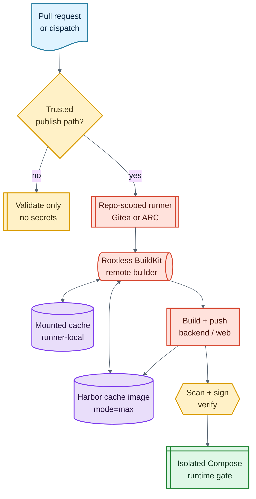

# Runner Options

Artifact Keeper backend and web images are large enough that runner placement and
cache design matter. The reference pattern assumes self-hosted runners with a
remote BuildKit builder and registry-backed caches.

## Why Custom Runners

Use custom runners when you need:

- Large persistent BuildKit caches.
- Access to an internal registry and smoke Kubernetes cluster.
- Predictable CPU, memory, disk, and network characteristics.
- Secret boundaries that separate validate-only PRs from trusted publish paths.
- Native cosign and Trivy binaries on daemonless runners.

A warm `mode=max` registry cache can turn large rebuilds from minutes into
seconds for source-only changes, while still preserving an external cache that
survives runner pod replacement. The working homelab pattern uses both: a
mounted BuildKit cache volume for fast same-runner rebuilds, plus Harbor-hosted
cache images for cross-runner and post-reschedule warm starts.

## Gitea Actions Pattern

The homelab implementation uses repository-scoped Gitea Actions runners. The
important reusable details are:

The complete runtime-sidecar contract, security boundaries, implementation
checklist, and sanitized manifests are in
[Podman Compose runner design](podman-compose-runner.md).

- Use repository-scoped labels such as `artifact-keeper-builder`; do not expose
  these runners as a general `ubuntu-latest` pool.
- Run jobs in host mode inside a hardened runner image, not Docker-in-Docker.
- Pair each runner pod with a rootless BuildKit sidecar and drive it with buildx
  using a remote builder endpoint, so the workflow can use ordinary
  `docker buildx build` commands without a Docker daemon or privileged DinD.
- Mount persistent volumes into the runner and BuildKit containers for
  runner-local state: the runner registration/work directory, BuildKit's local
  cache, and any tool caches worth keeping between pod restarts on the same
  node.
- Export/import BuildKit cache to an internal registry project such as
  `artifact-keeper-cache`. Harbor stores those cache references as OCI images,
  which makes the cache shareable across runner pods and recoverable after a pod
  replacement or node reschedule.
- Keep the local volume cache and registry cache as separate layers. The volume
  cache is the hot path; the Harbor cache image is the durable and cross-runner
  warm-start path.
- Keep the manual Kubernetes chart-smoke ServiceAccount narrowly scoped. The PR
  publish path should use the repository-scoped Compose runner with no
  Kubernetes token, pulling only builder-produced immutable digests. Keep
  compilation, scanning, and signing on BuildKit; use the Compose pool only for
  native-client, database-integration, and Playwright runtime phases.
- Put registry push credentials, cosign keys, and sync-bot credentials in
  repository Actions secrets. Do not pass them as runner-wide environment.
- Treat bot-authored upstream-sync PRs as validate-only unless a maintainer
  explicitly authorizes deployment.

## GitHub Actions ARC Pattern

For a GitHub-hosted version, use Actions Runner Controller (ARC) with a dedicated
runner scale set for this repository. Keep the same trust boundaries:

- Restrict the scale set to this repository or organization path.
- Use a custom runner image containing buildx, git, git-subtree, helm, kubectl,
  cosign, Trivy, make, and any language toolchains needed by source checks.
- Run a rootless BuildKit sidecar or a separately managed BuildKit service.
- Use persistent volume mounts for same-runner BuildKit cache and registry-backed
  `mode=max` caches for cross-runner reuse. In an enterprise GitHub setup the
  registry target might be ACR, ECR, GAR, GHCR, or another managed OCI registry
  instead of Harbor.
- Mount only the ServiceAccount permissions needed for the smoke namespace.
- Use GitHub Environments or workflow conditions so untrusted bot PRs cannot
  access registry, signing, or cluster secrets.
- Pin third-party actions by commit SHA.

ARC can autoscale build capacity while keeping this repository's expensive image
builds away from generic shared runners. It is a good fit for organizations that
want the same vendored deployment pattern but use GitHub as the source authority
instead of Gitea.

For runtime-only Compose jobs, use a separate ARC runner scale set with the
custom Podman sidecar pattern described in
[Podman Compose runner design](podman-compose-runner.md). Do not conflate that
scale set with ARC's built-in `dind` or `kubernetes` container modes: the
Podman pattern deliberately supplies its own Docker-compatible API and does not
grant the runner Kubernetes workload-creation permissions.

## Cache and Storage Notes

Use two cache layers:

- Runner-local mounted cache for fast repeated builds on the same runner. In
  Kubernetes this is usually a PVC or hostPath-like volume mounted at BuildKit's
  state directory, for example `/home/user/.local/share/buildkit` in a rootless
  BuildKit container.
- Registry cache for durable warm starts after runner replacement or reschedule.
  BuildKit pushes this as an OCI cache image with `--cache-to
  type=registry,ref=<registry>/<cache-project>/<image>:buildcache,mode=max` and
  imports it with the matching `--cache-from`.

The registry cache is the recovery layer. Do not rely on a single node-local
cache as the only copy of build acceleration state, and do not put release
artifacts in the same retention bucket as scratch images.

The homelab uses Harbor for this initial OCI intake because it is a deliberately
dissimilar dependency from Artifact Keeper itself: Artifact Keeper should not
have to serve the image or cache artifacts required to build and deploy Artifact
Keeper. In a corporate environment, the same role can be filled by a managed OCI
registry such as ACR, ECR, GAR, GHCR Enterprise, or a hosted Harbor deployment.
The key contract is not "must be Harbor"; it is "the build/promotion registry is
available before Artifact Keeper and is independent enough to avoid circular
bootstrap dependencies."

## Minimal Secret Set

A trusted publish path usually needs:

| Secret | Scope | Purpose |
| --- | --- | --- |
| `HARBOR_REGISTRY` or equivalent | publish workflow | registry hostname |
| `HARBOR_USERNAME` | publish workflow | push/pull robot |
| `HARBOR_PASSWORD` | publish workflow | push/pull robot secret |
| `COSIGN_PRIVATE_KEY` | sign step only | image signing |
| `COSIGN_PASSWORD` | sign step only | image signing |
| `SYNC_BOT_TOKEN` | upstream sync only | open/update vendor PRs |
| `SYNC_BOT_SIGNING_KEY` | upstream sync only | signed bot commits |

Use your platform's secret store names if they differ. The principle is more
important than the exact variable names: validate-only jobs do not receive
publish or signing secrets.
